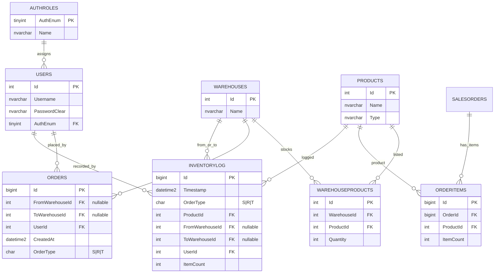

# Lagerstyrings System — ER‑diagram & MS-SQL (SQL Server)

---

## ER‑diagram (Mermaid)

```mermaid
erDiagram
    AUTHROLES ||--o{ USERS : assigns

    WAREHOUSES ||--o{ WAREHOUSEPRODUCTS : stocks
    PRODUCTS   ||--o{ WAREHOUSEPRODUCTS : listed

    USERS      ||--o{ ORDERS    : placed_by

    WAREHOUSES ||--o{ ORDERS    : from_or_to

    SALESORDERS    ||--o{ ORDERITEMS      : has_items

    PRODUCTS ||--o{ ORDERITEMS      : product

    PRODUCTS   ||--o{ INVENTORYLOG : logged
    WAREHOUSES ||--o{ INVENTORYLOG : from_or_to
    USERS      ||--o{ INVENTORYLOG : recorded_by

    AUTHROLES {
        tinyint AuthEnum PK
        nvarchar Name
    }
    USERS {
        int Id PK
        nvarchar Username
        nvarchar PasswordClear
        tinyint AuthEnum FK
    }
    WAREHOUSES {
        int Id PK
        nvarchar Name
    }
    PRODUCTS {
        int Id PK
        nvarchar Name
        nvarchar Type
    }
    WAREHOUSEPRODUCTS {
        int Id PK
        int WarehouseId FK
        int ProductId FK
        int Quantity
    }
    ORDERS {
        bigint Id PK
        int FromWarehouseId FK  "nullable"
        int ToWarehouseId   FK  "nullable"
        int UserId          FK
        datetime2 CreatedAt
        char OrderType  "S|R|T"
    }
    ORDERITEMS {
        bigint Id PK
        bigint OrderId   FK
        int ProductId    FK
        int ItemCount
    }
    
    INVENTORYLOG {
        bigint Id PK
        datetime2 Timestamp
        char OrderType  "S|R|T"
        int ProductId   FK
        int FromWarehouseId FK  "nullable"
        int ToWarehouseId   FK  "nullable"
        int UserId          FK
        int ItemCount
    }
```
