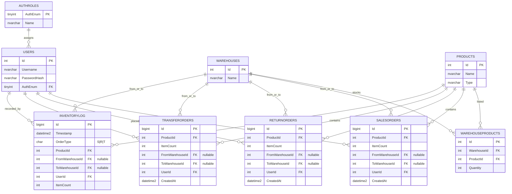

# Lagerstyrings System — ER‑diagram & MS-SQL (SQL Server)

---

## ER‑diagram (Mermaid)



---

## MS‑SQL (T‑SQL) — kør i rækkefølge

```sql
-- 1) Lookup for roller/autorisation (AuthEnum)
CREATE TABLE dbo.AuthRoles (
    AuthEnum     TINYINT       NOT NULL PRIMARY KEY,
    Name         NVARCHAR(32)  NOT NULL UNIQUE
);

-- 2) Brugere (hash frem for klartekst)
CREATE TABLE dbo.Users (
    Id           INT           IDENTITY(1,1) PRIMARY KEY,
    Username     NVARCHAR(100) NOT NULL UNIQUE,
    PasswordHash NVARCHAR(200) NOT NULL,
    AuthEnum     TINYINT       NOT NULL,
    CONSTRAINT FK_Users_AuthRoles
        FOREIGN KEY (AuthEnum) REFERENCES dbo.AuthRoles(AuthEnum)
);

-- 3) Lagre
CREATE TABLE dbo.Warehouses (
    Id           INT           IDENTITY(1,1) PRIMARY KEY,
    Name         NVARCHAR(200) NOT NULL UNIQUE
);

-- 4) Produkter
CREATE TABLE dbo.Products (
    Id           INT           IDENTITY(1,1) PRIMARY KEY,
    Name         NVARCHAR(200) NOT NULL,
    [Type]       NVARCHAR(50)  NULL
);
CREATE INDEX IX_Products_Name ON dbo.Products(Name);

-- 5) Lagerlinjer (unik pr. Warehouse+Product)
CREATE TABLE dbo.WarehouseProducts (
    Id           INT  IDENTITY(1,1) PRIMARY KEY,
    WarehouseId  INT  NOT NULL,
    ProductId    INT  NOT NULL,
    Quantity     INT  NOT NULL,
    CONSTRAINT CK_WarehouseProducts_Quantity CHECK (Quantity >= 0),
    CONSTRAINT UQ_WarehouseProducts UNIQUE (WarehouseId, ProductId),
    CONSTRAINT FK_WarehouseProducts_Warehouse FOREIGN KEY (WarehouseId) REFERENCES dbo.Warehouses(Id),
    CONSTRAINT FK_WarehouseProducts_Product   FOREIGN KEY (ProductId)   REFERENCES dbo.Products(Id)
);
CREATE INDEX IX_WarehouseProducts_ProductId   ON dbo.WarehouseProducts(ProductId);
CREATE INDEX IX_WarehouseProducts_WarehouseId ON dbo.WarehouseProducts(WarehouseId);

-- 6) Salgsordre
CREATE TABLE dbo.SalesOrders (
    Id               BIGINT IDENTITY(1,1) PRIMARY KEY,
    ProductId        INT      NOT NULL,
    ItemCount        INT      NOT NULL,
    FromWarehouseId  INT      NULL,
    ToWarehouseId    INT      NULL,
    UserId           INT      NOT NULL,
    CreatedAt        DATETIME2(3) NOT NULL CONSTRAINT DF_SalesOrders_CreatedAt DEFAULT (SYSUTCDATETIME()),
    CONSTRAINT CK_SalesOrders_ItemCount CHECK (ItemCount > 0),
    CONSTRAINT FK_SalesOrders_Product        FOREIGN KEY (ProductId)       REFERENCES dbo.Products(Id),
    CONSTRAINT FK_SalesOrders_FromWarehouse  FOREIGN KEY (FromWarehouseId) REFERENCES dbo.Warehouses(Id),
    CONSTRAINT FK_SalesOrders_ToWarehouse    FOREIGN KEY (ToWarehouseId)   REFERENCES dbo.Warehouses(Id),
    CONSTRAINT FK_SalesOrders_User           FOREIGN KEY (UserId)          REFERENCES dbo.Users(Id)
);
CREATE INDEX IX_SalesOrders_ProductId        ON dbo.SalesOrders(ProductId);
CREATE INDEX IX_SalesOrders_FromWarehouseId  ON dbo.SalesOrders(FromWarehouseId);
CREATE INDEX IX_SalesOrders_ToWarehouseId    ON dbo.SalesOrders(ToWarehouseId);
CREATE INDEX IX_SalesOrders_UserId           ON dbo.SalesOrders(UserId);
CREATE INDEX IX_SalesOrders_CreatedAt        ON dbo.SalesOrders(CreatedAt);

-- 7) Returordre
CREATE TABLE dbo.ReturnOrders (
    Id               BIGINT IDENTITY(1,1) PRIMARY KEY,
    ProductId        INT      NOT NULL,
    ItemCount        INT      NOT NULL,
    FromWarehouseId  INT      NULL,
    ToWarehouseId    INT      NULL,
    UserId           INT      NOT NULL,
    CreatedAt        DATETIME2(3) NOT NULL CONSTRAINT DF_ReturnOrders_CreatedAt DEFAULT (SYSUTCDATETIME()),
    CONSTRAINT CK_ReturnOrders_ItemCount CHECK (ItemCount > 0),
    CONSTRAINT FK_ReturnOrders_Product        FOREIGN KEY (ProductId)       REFERENCES dbo.Products(Id),
    CONSTRAINT FK_ReturnOrders_FromWarehouse  FOREIGN KEY (FromWarehouseId) REFERENCES dbo.Warehouses(Id),
    CONSTRAINT FK_ReturnOrders_ToWarehouse    FOREIGN KEY (ToWarehouseId)   REFERENCES dbo.Warehouses(Id),
    CONSTRAINT FK_ReturnOrders_User           FOREIGN KEY (UserId)          REFERENCES dbo.Users(Id)
);
CREATE INDEX IX_ReturnOrders_ProductId        ON dbo.ReturnOrders(ProductId);
CREATE INDEX IX_ReturnOrders_FromWarehouseId  ON dbo.ReturnOrders(FromWarehouseId);
CREATE INDEX IX_ReturnOrders_ToWarehouseId    ON dbo.ReturnOrders(ToWarehouseId);
CREATE INDEX IX_ReturnOrders_UserId           ON dbo.ReturnOrders(UserId);
CREATE INDEX IX_ReturnOrders_CreatedAt        ON dbo.ReturnOrders(CreatedAt);

-- 8) Overførselsordre
CREATE TABLE dbo.TransferOrders (
    Id               BIGINT IDENTITY(1,1) PRIMARY KEY,
    ProductId        INT      NOT NULL,
    ItemCount        INT      NOT NULL,
    FromWarehouseId  INT      NULL,
    ToWarehouseId    INT      NULL,
    UserId           INT      NOT NULL,
    CreatedAt        DATETIME2(3) NOT NULL CONSTRAINT DF_TransferOrders_CreatedAt DEFAULT (SYSUTCDATETIME()),
    CONSTRAINT CK_TransferOrders_ItemCount CHECK (ItemCount > 0),
    CONSTRAINT FK_TransferOrders_Product        FOREIGN KEY (ProductId)       REFERENCES dbo.Products(Id),
    CONSTRAINT FK_TransferOrders_FromWarehouse  FOREIGN KEY (FromWarehouseId) REFERENCES dbo.Warehouses(Id),
    CONSTRAINT FK_TransferOrders_ToWarehouse    FOREIGN KEY (ToWarehouseId)   REFERENCES dbo.Warehouses(Id),
    CONSTRAINT FK_TransferOrders_User           FOREIGN KEY (UserId)          REFERENCES dbo.Users(Id)
);
CREATE INDEX IX_TransferOrders_ProductId        ON dbo.TransferOrders(ProductId);
CREATE INDEX IX_TransferOrders_FromWarehouseId  ON dbo.TransferOrders(FromWarehouseId);
CREATE INDEX IX_TransferOrders_ToWarehouseId    ON dbo.TransferOrders(ToWarehouseId);
CREATE INDEX IX_TransferOrders_UserId           ON dbo.TransferOrders(UserId);
CREATE INDEX IX_TransferOrders_CreatedAt        ON dbo.TransferOrders(CreatedAt);

-- 9) Log af bevægelser
CREATE TABLE dbo.InventoryLog (
    Id               BIGINT IDENTITY(1,1) PRIMARY KEY,
    [Timestamp]      DATETIME2(3) NOT NULL CONSTRAINT DF_InventoryLog_Timestamp DEFAULT (SYSUTCDATETIME()),
    OrderType        CHAR(1)      NOT NULL,
    ProductId        INT          NOT NULL,
    FromWarehouseId  INT          NULL,
    ToWarehouseId    INT          NULL,
    ItemCount        INT          NOT NULL,
    UserId           INT          NOT NULL,
    CONSTRAINT CK_InventoryLog_ItemCount CHECK (ItemCount > 0),
    CONSTRAINT CK_InventoryLog_OrderType CHECK (OrderType IN ('S','R','T')),
    CONSTRAINT FK_InventoryLog_Product        FOREIGN KEY (ProductId)       REFERENCES dbo.Products(Id),
    CONSTRAINT FK_InventoryLog_FromWarehouse  FOREIGN KEY (FromWarehouseId) REFERENCES dbo.Warehouses(Id),
    CONSTRAINT FK_InventoryLog_ToWarehouse    FOREIGN KEY (ToWarehouseId)   REFERENCES dbo.Warehouses(Id),
    CONSTRAINT FK_InventoryLog_User           FOREIGN KEY (UserId)          REFERENCES dbo.Users(Id)
);
CREATE INDEX IX_InventoryLog_Timestamp ON dbo.InventoryLog([Timestamp]);
CREATE INDEX IX_InventoryLog_ProductId ON dbo.InventoryLog(ProductId);
CREATE INDEX IX_InventoryLog_UserId    ON dbo.InventoryLog(UserId);

-- 10) Seed roller (valgfrit)
INSERT INTO dbo.AuthRoles(AuthEnum, Name) VALUES
  (1, N'Admin'),
  (2, N'StoreUser'),
  (3, N'WarehouseUser');
```

### (Valgfrit) Triggere til automatisk logning

> Disse indsætter en logrække pr. ny ordre. Afkommentér hvis du vil køre med automatisk `InventoryLog`.

```sql
/* SalesOrders -> InventoryLog */
CREATE OR ALTER TRIGGER dbo.tr_SalesOrders_Log
ON dbo.SalesOrders
AFTER INSERT AS
BEGIN
  SET NOCOUNT ON;
  INSERT dbo.InventoryLog (OrderType, ProductId, FromWarehouseId, ToWarehouseId, ItemCount, UserId)
  SELECT 'S', i.ProductId, i.FromWarehouseId, i.ToWarehouseId, i.ItemCount, i.UserId
  FROM inserted i;
END;
GO

/* ReturnOrders -> InventoryLog */
CREATE OR ALTER TRIGGER dbo.tr_ReturnOrders_Log
ON dbo.ReturnOrders
AFTER INSERT AS
BEGIN
  SET NOCOUNT ON;
  INSERT dbo.InventoryLog (OrderType, ProductId, FromWarehouseId, ToWarehouseId, ItemCount, i.UserId)
  SELECT 'R', i.ProductId, i.FromWarehouseId, i.ToWarehouseId, i.ItemCount, i.UserId
  FROM inserted i;
END;
GO

/* TransferOrders -> InventoryLog */
CREATE OR ALTER TRIGGER dbo.tr_TransferOrders_Log
ON dbo.TransferOrders
AFTER INSERT AS
BEGIN
  SET NOCOUNT ON;
  INSERT dbo.InventoryLog (OrderType, ProductId, FromWarehouseId, ToWarehouseId, ItemCount, i.UserId)
  SELECT 'T', i.ProductId, i.FromWarehouseId, i.ToWarehouseId, i.ItemCount, i.UserId
  FROM inserted i;
END;
GO
```

---

### (Valgfrit) Hjælpe‑indeks og views

```sql
-- Hurtig opslag på lagerbeholdning pr. produkt
CREATE OR ALTER VIEW dbo.vw_ProductStock AS
SELECT p.Id       AS ProductId,
       p.Name     AS ProductName,
       SUM(wp.Quantity) AS TotalQuantity
FROM dbo.Products p
LEFT JOIN dbo.WarehouseProducts wp ON wp.ProductId = p.Id
GROUP BY p.Id, p.Name;
```